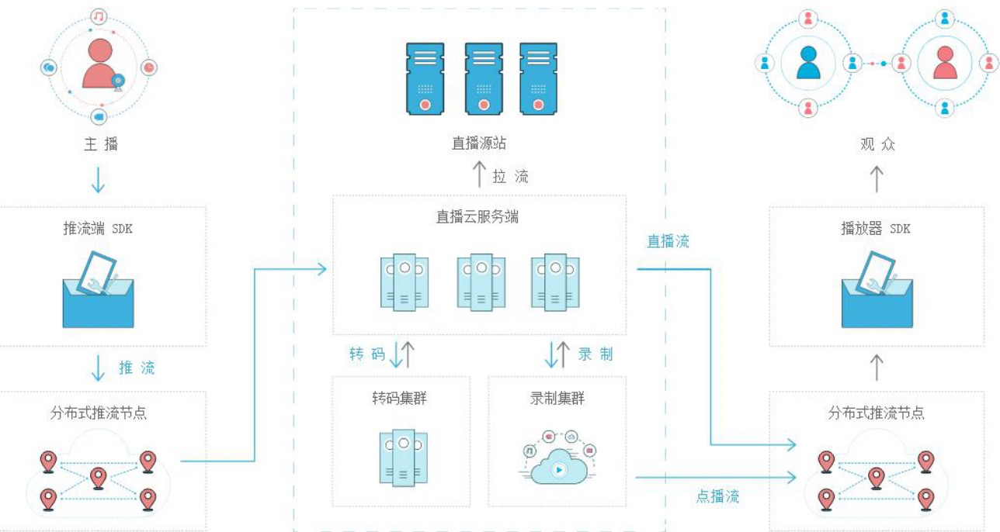
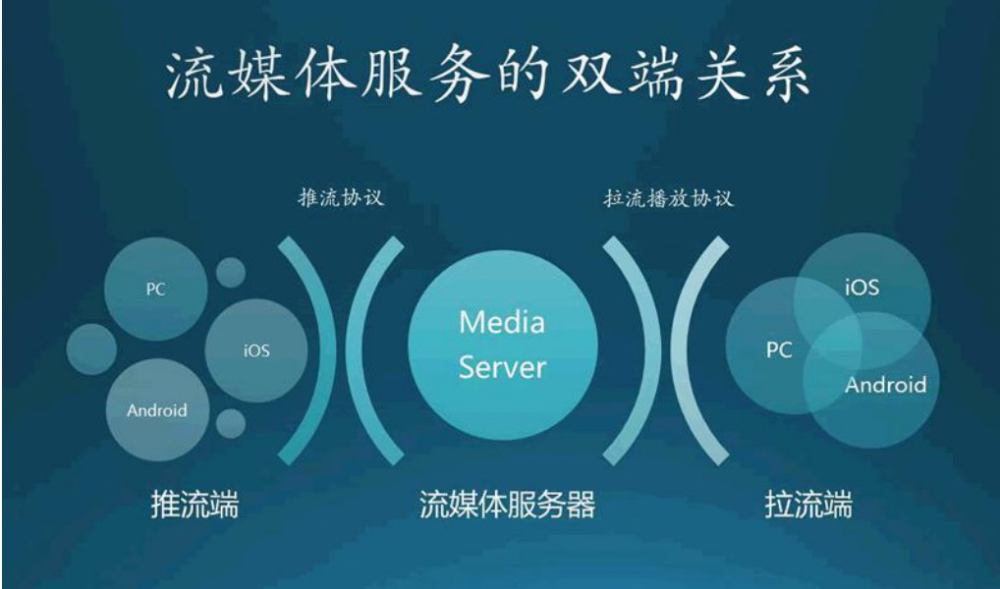
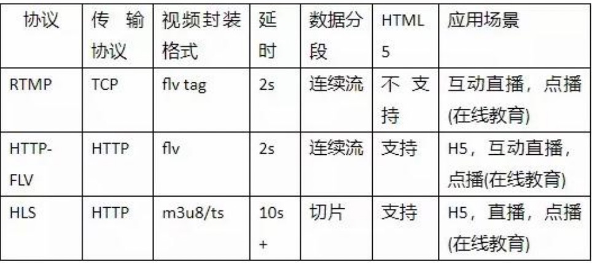

# 第一节 从0到1打造流媒体在线直播系统

## 1.1  直播的简单介绍

- 说到直播，大家应该不陌生，有电视直播、网络主播、游戏直播、体育直播、在线教育 

直播等等。

- 那么要实现在线直播的话我们必须要有“流媒体在线直播服务器”。

- “流媒体在线直播服务器”不仅可以让我们实现游戏、赛事、电商、媒体、教育等行业 

的直播。还可以实现农场监控直播、幼儿园监控直播、家庭监控直播（保姆）、企业内部监 

控直播等...

## 1.2 流媒体在线直播的服务器的实现方式：

1. 基于 Nginx 与 Nginx-rtmp-module 实现直播流媒体服务器。
2. 后端语言实现直播流媒体服务器。（这里主要讲解 nodejs 实现直播流媒体服务器）
3. 第三方平台实现推流服务器七牛云、腾讯的直播 LVB、网易云信 SDK、趣拍云。 

## 1.3 流媒体在线直播系统教程功能介绍

1. 实现分享本地计算机屏幕实现直播 、可用于在线教育、游戏直播 

2. 实现电脑摄像头直播（网络主播） 

3. 实现手机直播 

4. 实现农场监控直播、幼儿园监控直播 

5. 保姆监控直播 

6. 可以在 PC 端、手机 APP、微信、微信小程序中看直播

## 1.4 直播的实现流程

**直播主要通过两步实现：** 1、推流 2、拉流 

**推流：**指的是把采集阶段封包好的内容传输到服务器的过程。推流的设备可以是计算机也可以是摄像机、或者手机。 

**拉流：**指服务器已有直播内容，用指定地址进行拉取播放的过程。

## 1.5 流媒体服务器的几种协议

**推流协议**：RTMP（Real Time Messaging Protocol）即实时消息传输协议，是 Adobe 公司开发的一个基于 TCP 的应用层协议，目前国内的视频云服务都是以 RTMP 为主要推流协议。 

**拉流协议**:RTMP、Http-Flv、hls、dash。目前用的最多的 HttpFlv，（B 站）Flv.js 的诞生让我们可以在 H5 中直接拉流。 

HTTP-FLV 使用类似 RTMP 流式的 HTTP 长连接，需由特定流媒体服务器分发的，兼顾两者的优点。

`编写人:ling`