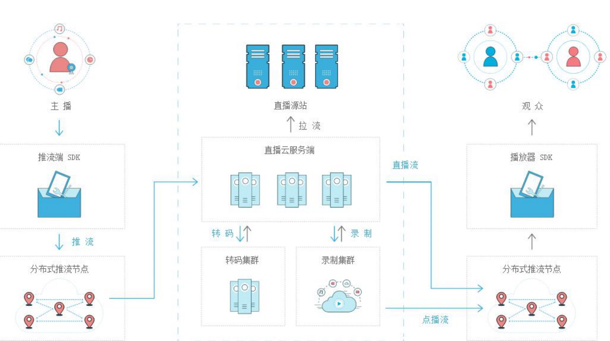
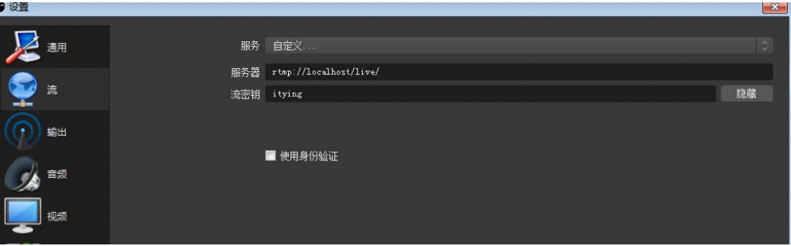

# 第三节 通过Nodejs搭建自己的流媒体服务器实现直播-单核

## 3.1 推流拉流实现流程



## 3.2 借助NodeJS模块Node-Media-Server搭建自己的流媒体服务器

1. **Node-Media-Server github地址**:https://github.com/illuspas/Node-Media-Server

2. **创建自己的流媒体服务器**

   - 安装 node-media-serve

     ```javascript
     npm install node-media-server
     ```

   - 新建 mediaServer.js 复制下面代码

     ```javascript
     	const {	NodeMediaServer } = require('node-media-server');
     	const config = {
     		rtmp: {
     			port: 1935,
     			chunk_size: 60000,
     			gop_cache: true,
     			ping: 60,
     			ping_timeout: 30
     		},
     		http: {
     			port: 8000,
     			allow_origin: '*'
     		}
     	};
     	var nms = new NodeMediaServer(config);
     	nms.run();
     ```

   - 运行项目

     ```javascript
     node mediaServer.js
     ```

   - 使用obs进行推流

     ```javascript
     //推流地址
     URL :rtmp://localhost/live 
     //流名称
     Stream key : STREAM_NAME
     ```

     

   - 进行拉流

     **RTMP**

     ```
     rtmp://localhost/live/STREAM_NAME
     ```

     **http-flv**

     ```
     http://localhost:8000/live/STREAM_NAME.flv
     ```

     **websocket-flv**

     ```
     ws://localhost:8000/live/STREAM_NAME.flv
     ```

     **HLS**

     ```
     http://localhost:8000/live/STREAM_NAME/index.m3u8
     ```

     **DASH** 

     ```
     http://localhost:8000/live/STREAM_NAME/index.mpd
     ```

## 3.3 H5客户端中分别使用RTMP协议以及HTTP-FLV协议拉流

1. 使用HTTP-FLV拉流

   ```html
   <!DOCTYPE html>
   <html>
   	<head>
   		<meta charset="UTF-8">
   		<title></title>
   	</head>
   	<body>
   		
   		<script src="https://cdn.bootcss.com/flv.js/1.4.0/flv.min.js"></script>
   		<video id="videoElement" style="width: 80%;" controls="controls"></video>
   		<script>
   		    if (flvjs.isSupported()) {
   		        var videoElement = document.getElementById('videoElement');
   		        var flvPlayer = flvjs.createPlayer({
   		            type: 'flv',
   					url:'http://l.9yuecloud.com/live/9yue.flv'
   		        });
   		        flvPlayer.attachMediaElement(videoElement);
   		        flvPlayer.load();
   		        flvPlayer.play();
   		    }
   		</script>
   	</body>
   </html>
   ```

2. 使用RTMP拉流

   ```html
   <html>
   	<head>
   		<title>视频直播</title>
   		<meta charset="utf-8">
   		<link href="http://vjs.zencdn.net/5.5.3/video-js.css" rel="stylesheet">
   		<!-- If you'd like to support IE8 -->
   		<script src="http://vjs.zencdn.net/ie8/1.1.1/videojs-ie8.min.js"></script>
   	</head>
   	<body>
   		<h1>直播间</h1>
   		<video id="my-video" class="video-js" controls preload="auto" width="640" height="300" poster="http://ppt.downhot.com/d/file/p/2014/08/12/9d92575b4962a981bd9af247ef142449.jpg"
   		 data-setup="{}">
   			<source src="rtmp://yun.apiying.com/live/itying?txSecret=b88411dcd273662bd02b410b68f0ccff&txTime=5C922E5F" type="rtmp/flv">
   			<!-- 如果上面的rtmp流无法播放，就播放hls流 -->
   			<!-- <source src="http://10.10.5.119/live/livestream.m3u8" type='application/x-mpegURL'> -->
   			<p class="vjs-no-js">播放视频需要启用 JavaScript，推荐使用支持HTML5的浏览器访问。
   				To view this video please enable JavaScript, and consider upgrading to a web browser that
   				<a href="http://videojs.com/html5-video-support/" target="_blank">supports HTML5 video</a>
   			</p>
   		</video>
   		<script src="http://vjs.zencdn.net/5.5.3/video.js"></script>
   	</body>
   </html>
   ```

   `编写人:ling`