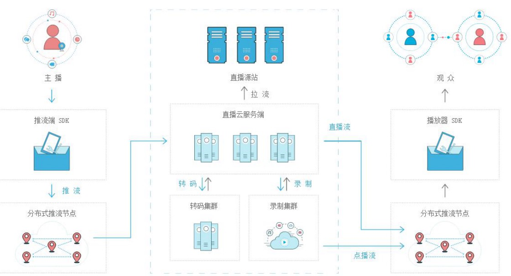

# 第二节 借助腾讯云直播实现在线直播

## 2.1 推拉流实现流程



## 2.2 推流拉流工具介绍

1. 推流工具：OBS（可以用于 win、linux、Mac）、RTMP 推流摄像机

2. 拉流工具：VlC（mac、linux、win 、手机）

3. H5客户端进行拉流(网页、小程序、APP)

## 2.3 腾讯云直播平台生成推流地址以及拉流地址

1. 购买域名与服务器并进行备案
2. 在腾讯云控制台开通腾讯云直播
3. 配置二级域名
4. 配置推流与拉流地址
5. 使用OBS实现推流

## 2.4 H5客户端中分别使用RTMP协议以及HTTP-FLV协议拉流

1. 使用HTTP-FLV拉流

   ```html
   <!DOCTYPE html>
   <html>
   	<head>
   		<meta charset="UTF-8">
   		<title></title>
   	</head>
   	<body>
   		
   		<script src="https://cdn.bootcss.com/flv.js/1.4.0/flv.min.js"></script>
   		<video id="videoElement" style="width: 80%;" controls="controls"></video>
   		<script>
   		    if (flvjs.isSupported()) {
   		        var videoElement = document.getElementById('videoElement');
   		        var flvPlayer = flvjs.createPlayer({
   		            type: 'flv',
   					url:'http://l.9yuecloud.com/live/9yue.flv'
   		        });
   		        flvPlayer.attachMediaElement(videoElement);
   		        flvPlayer.load();
   		        flvPlayer.play();
   		    }
   		</script>
   	</body>
   </html>
   ```

2. 使用RTMP拉流

   ```html
   <html>
   	<head>
   		<title>视频直播</title>
   		<meta charset="utf-8">
   		<link href="http://vjs.zencdn.net/5.5.3/video-js.css" rel="stylesheet">
   		<!-- If you'd like to support IE8 -->
   		<script src="http://vjs.zencdn.net/ie8/1.1.1/videojs-ie8.min.js"></script>
   	</head>
   	<body>
   		<h1>直播间</h1>
   		<video id="my-video" class="video-js" controls preload="auto" width="640" height="300" poster="http://ppt.downhot.com/d/file/p/2014/08/12/9d92575b4962a981bd9af247ef142449.jpg"
   		 data-setup="{}">
   			<source src="rtmp://yun.apiying.com/live/itying?txSecret=b88411dcd273662bd02b410b68f0ccff&txTime=5C922E5F" type="rtmp/flv">
   			<!-- 如果上面的rtmp流无法播放，就播放hls流 -->
   			<!-- <source src="http://10.10.5.119/live/livestream.m3u8" type='application/x-mpegURL'> -->
   			<p class="vjs-no-js">播放视频需要启用 JavaScript，推荐使用支持HTML5的浏览器访问。
   				To view this video please enable JavaScript, and consider upgrading to a web browser that
   				<a href="http://videojs.com/html5-video-support/" target="_blank">supports HTML5 video</a>
   			</p>
   		</video>
   		<script src="http://vjs.zencdn.net/5.5.3/video.js"></script>
   	</body>
   </html>
   ```

`编写人: ling`